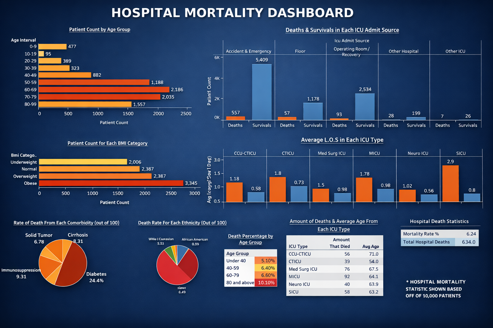

# 🏥 Hospital Mortality Analysis & Dashboard

  

---

## 🚀 Project Overview

This project analyzes hospital patient data to identify key factors influencing in-hospital mortality.

Using SQL for data analysis and a dashboard for visualization, the project uncovers patterns in patient demographics, ICU performance, and clinical indicators that impact survival outcomes.

---

## 🎯 Objective

To identify major predictors of hospital mortality and provide insights that can help improve patient care and clinical decision-making.

---

## 🛠️ Tools & Technologies

* SQL (MySQL)
* Data Analysis
* Data Cleaning
* Dashboard Visualization (Tableau / BI Tool)
* Excel (Preprocessing)

---

## 📂 Project Files

* `Hospital_Mortality_SQL_Analysis.sql` → SQL queries for analysis
* `Hospital_Mortality_Dasboard.png` → Dashboard visualization
* `README.md` → Project documentation

---

## 🔍 Approach

1. **Data Cleaning**

   * Handled missing values (e.g., ethnicity)
   * Structured dataset for analysis

2. **SQL Analysis**

   * Mortality rate calculation
   * Demographic analysis (age, gender, ethnicity)
   * ICU-based comparisons
   * Comorbidity impact analysis
   * Length of stay evaluation

3. **Data Visualization**

   * Built an interactive dashboard
   * Highlighted key trends and insights
   * Simplified complex data for better understanding

---

## 📊 Key Insights

* **Overall Mortality Rate:** ~6.3% of admitted patients
* **Age Factor:** Mortality significantly increases with age, especially above 60
* **ICU Insights:** Certain ICU types and admission sources show higher death rates
* **Comorbidities:** Conditions like diabetes and immunosuppression strongly impact mortality
* **Length of Stay:** Longer ICU stays are associated with higher risk
* **Heart Rate & Health Indicators:** Elevated heart rates correlate with critical conditions

---

## 📈 Dashboard Highlights

The dashboard provides:

* Patient distribution by age and BMI
* Death vs survival comparison across ICU types
* Average length of stay analysis
* Mortality trends across demographics

---

## 💡 Conclusion

The analysis reveals that **age, comorbidities, ICU type, and length of stay** are key drivers of hospital mortality.

These insights can help healthcare professionals:

* Identify high-risk patients early
* Improve ICU resource allocation
* Enhance treatment strategies

---

## 🔮 Future Improvements

* Integrate real-time hospital data
* Apply machine learning models for prediction
* Include additional variables (treatment, medications, socioeconomic factors)
* Build a fully interactive dashboard

---

## 👤 Author

**Samarth Singh**

---

## ⭐ If you found this useful

Give this repository a star on GitHub!
